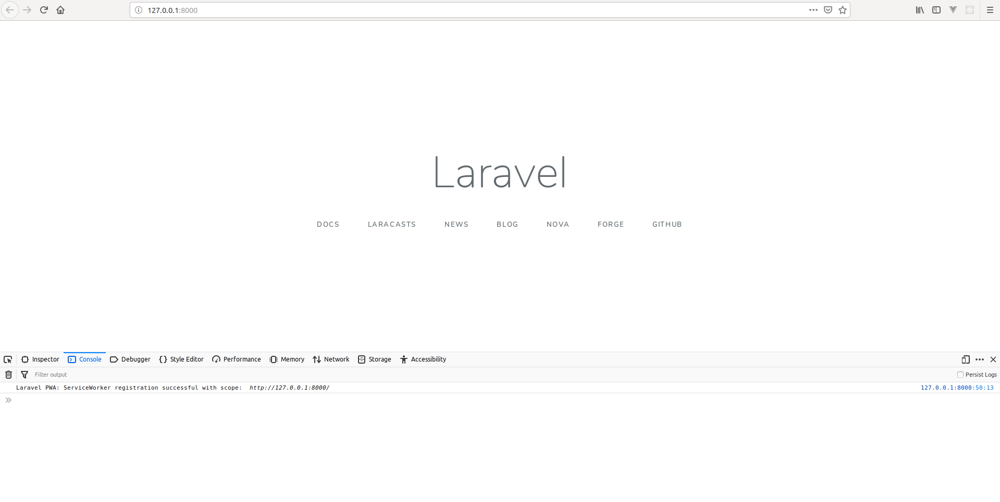

<p align="center"></p>

## Laravel PWA Demo

This demo is showing how to use the `laravel-pwa`.

For this I am using the following libraries versions.

- Laravel: 5.8.3
- Laravel-pwa: 1.0.4

## The used steps

#### 1. After I have installed these libraries and following all steps from `laravel-pwa` `README.md`, I have needed to create a new folder called `layouts` in `resources/views/` folder.

#### 2. Then I created a new file `app.blade.php` inside `layouts` folder. On this file I created two sections using `@yield` directive, the first was the `@yield('title')` and second the `@yield('content')`. But the most important is! Put the `@laravelPWA` directive on `<head>`. 
```html
<!doctype html>
<html lang="{{ str_replace('_', '-', app()->getLocale()) }}">
    <head>
        <meta charset="utf-8">
        <meta name="viewport" content="width=device-width, initial-scale=1">

        <title>Laravel - @yield('title')</title>

        <!-- Fonts -->
        <link href="https://fonts.googleapis.com/css?family=Nunito:200,600" rel="stylesheet">

        @laravelPWA


        <!-- Styles -->
        <style>
            html, body {
                background-color: #fff;
                color: #636b6f;
                font-family: 'Nunito', sans-serif;
                font-weight: 200;
                height: 100vh;
                margin: 0;
            }

            .full-height {
                height: 100vh;
            }

            .flex-center {
                align-items: center;
                display: flex;
                justify-content: center;
            }

            .position-ref {
                position: relative;
            }

            .top-right {
                position: absolute;
                right: 10px;
                top: 18px;
            }

            .content {
                text-align: center;
            }

            .title {
                font-size: 84px;
            }

            .links > a {
                color: #636b6f;
                padding: 0 25px;
                font-size: 13px;
                font-weight: 600;
                letter-spacing: .1rem;
                text-decoration: none;
                text-transform: uppercase;
            }

            .m-b-md {
                margin-bottom: 30px;
            }
        </style>
    </head>
    <body>
        @yield('content')        
    </body>
</html>
```
#### 3. After I have modified the `welcome.blade.php` for to use ours new layout. See it bellow.

```html
@extends('layouts.app')


@section('title', 'Welcome')


@section('content')
    <div class="flex-center position-ref full-height">
        @if (Route::has('login'))
            <div class="top-right links">
                @auth
                    <a href="{{ url('/home') }}">Home</a>
                @else
                    <a href="{{ route('login') }}">Login</a>

                    @if (Route::has('register'))
                        <a href="{{ route('register') }}">Register</a>
                    @endif
                @endauth
            </div>
        @endif

        <div class="content">
            <div class="title m-b-md">
                Laravel
            </div>

            <div class="links">
                <a href="https://laravel.com/docs">Docs</a>
                <a href="https://laracasts.com">Laracasts</a>
                <a href="https://laravel-news.com">News</a>
                <a href="https://blog.laravel.com">Blog</a>
                <a href="https://nova.laravel.com">Nova</a>
                <a href="https://forge.laravel.com">Forge</a>
                <a href="https://github.com/laravel/laravel">GitHub</a>
            </div>
        </div>
    </div>
@endsection
```
### 4. Is it ready? Yes, it is!

## Run the demo project

install dependences

```console
composer install
```

Creating the `.env`

```console
cp .env.example .env
```

Generating the key.

```console
php artisan key:generate
```

To run this project you must use the Laravel Artisan serve command.
```console
php artisan serve
```
Open your browser and put this address in URL field `http://127.0.0.1:8000/`

Now you can check if the serviceworker is working, to this open the browser web console.
It must show the message `Laravel PWA: ServiceWorker registration successful with scope: http://127.0.0.1:8000/` on console tab as the image bellow.



## Enjoy!
